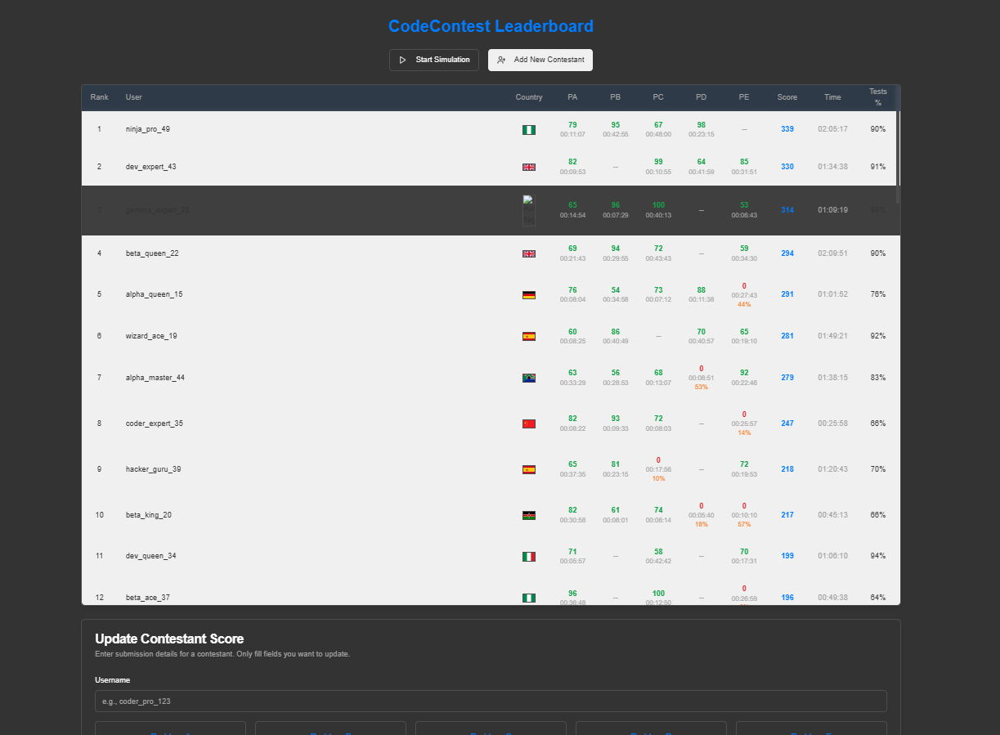
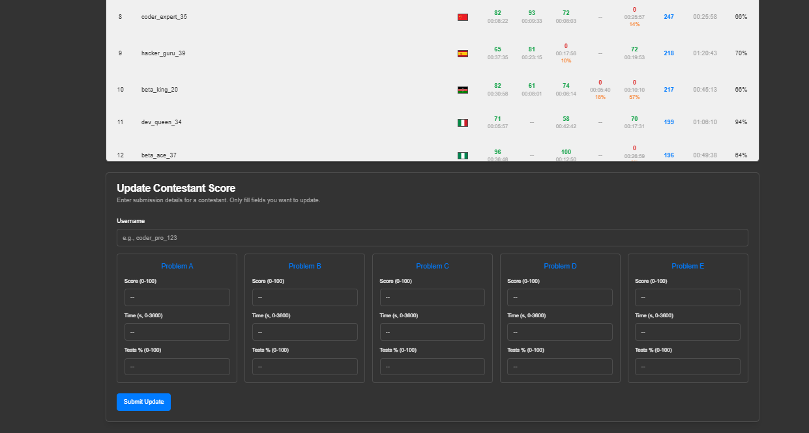

# Contestant Leaderboard

## Overview

This project is a Next.js application designed to display and manage a leaderboard of contestants for a coding contest. The application features a user-friendly interface with real-time data simulation, score updates, and an intuitive design, built using modern web technologies.

### App Screenshots


*A screenshot of the main leaderboard view.*


*A screenshot of the contestant update form.*

## Features

*   **Dynamic Leaderboard:** Displays contestant rankings based on score and penalty time.
*   **Real-time Simulation:** Simulates score updates and new contestant entries.
*   **Manual Updates:** Allows updating contestant scores, time penalties, and system test percentages via a form.
*   **Contestant Details:** Shows usernames and country flags (with tooltips).
*   **Smooth Rank Transitions:** Uses Framer Motion for animated rank changes.
*   **Responsive Design:** Adapts to various screen sizes.
*   **Accessible:** Includes ARIA attributes and keyboard navigation where appropriate.
*   **Loading States:** Uses skeleton loaders for a better initial loading experience.

## Technologies Used

*   **Framework:** [Next.js](https://nextjs.org/) 15 (App Router)
*   **Language:** [TypeScript](https://www.typescriptlang.org/)
*   **Styling:** [Tailwind CSS](https://tailwindcss.com/) with CSS Variables (via `globals.css`)
*   **UI Components:** [Shadcn/ui](https://ui.shadcn.com/) (built on Radix UI primitives)
*   **Icons:** [Lucide React](https://lucide.dev/)
*   **State Management:** React Hooks (`useState`, `useEffect`, `useRef`, `useMemo`)
*   **Forms:** [React Hook Form](https://react-hook-form.com/)
*   **Schema Validation:** [Zod](https://zod.dev/)
*   **Animations:** [Framer Motion](https://www.framer.com/motion/)
*   **Utilities:** `date-fns` (for potential date formatting, though `formatTime` is custom), `clsx`, `tailwind-merge`

## Key Libraries & Packages

*   `next`: The React framework for production.
*   `react`, `react-dom`: Core React libraries.
*   `typescript`: For static typing.
*   `tailwindcss`: Utility-first CSS framework.
*   `tailwindcss-animate`: Tailwind plugin for animations (used by Shadcn/ui).
*   `postcss`, `autoprefixer`: CSS processing tools.
*   `@radix-ui/*`: Underlying primitive components for Shadcn/ui (e.g., `@radix-ui/react-scroll-area`, `@radix-ui/react-tooltip`, `@radix-ui/react-dialog` for `useToast`).
*   `class-variance-authority`, `clsx`, `tailwind-merge`: Utilities for managing CSS classes.
*   `lucide-react`: Icon library.
*   `react-hook-form`: For building and managing forms.
*   `@hookform/resolvers`: Integrates Zod with React Hook Form.
*   `zod`: Schema definition and validation library.
*   `framer-motion`: Animation library for React.
*   `date-fns`: (Installed, but custom `formatTime` used) Date utility library.

*(Note: Genkit dependencies like `@genkit-ai/*` might be present but are not used in the core leaderboard functionality as implemented here.)*

## How to Run the App

Follow these steps to get the app running locally:

1.  **Clone the Repository:**
    ```bash
    git clone <repository-url>
    cd contestant-leaderboard
    ```

2.  **Install Dependencies:**
    ```bash
    npm install
    # or yarn install / pnpm install
    ```

3.  **Run the Development Server:**
    ```bash
    npm run dev
    # or yarn dev / pnpm dev
    ```
    The application uses Turbopack for faster development builds (default with `next dev`) and typically runs on `http://localhost:3000`. Check your terminal output for the exact port.

4.  **Open the App:**
    Navigate to the URL provided in your terminal (e.g., [http://localhost:3000](http://localhost:3000)) in your browser.

## Project Structure

```
.
├── public/             # Static assets (e.g., flags in public/assets/flags/)
│   └── assets/
│       └── flags/      # SVG flag icons (e.g., us.svg, ca.svg)
├── src/
│   ├── app/            # Next.js App Router directory
│   │   ├── globals.css # Global styles, Tailwind directives, CSS variables
│   │   ├── layout.tsx  # Root layout (incl. Toaster)
│   │   └── page.tsx    # Main page component (leaderboard logic)
│   ├── components/     # React components
│   │   ├── leaderboard/ # Leaderboard specific components (table, form)
│   │   └── ui/         # Shadcn/ui components (generated)
│   ├── data/           # Data generation and simulation logic
│   │   └── initial-contestants.ts
│   ├── hooks/          # Custom React hooks (e.g., useToast)
│   │   └── use-toast.ts
│   ├── lib/            # Utility functions
│   │   ├── utils.ts    # General utilities (cn, formatTime)
│   │   └── leaderboard-utils.ts # Calculation and sorting logic
│   └── types/          # TypeScript type definitions
│       └── contestant.ts
├── docs/               # Documentation files
│   ├── all-dev-tutorial.md # Step-by-step guide
│   ├── leaderboard-view.png
│   └── update-form.png
├── tailwind.config.ts  # Tailwind CSS configuration
├── components.json     # Shadcn/ui configuration
├── next.config.mjs     # Next.js configuration (if customized)
├── tsconfig.json       # TypeScript configuration
├── package.json        # Project dependencies and scripts
└── README.md           # This file
```

## Core Logic Explained

1.  **Initialization (`src/app/page.tsx`)**:
    *   The page component (`Home`) uses `useState` to hold the `contestants` array. It starts empty (`[]`).
    *   A `useEffect` hook runs *only on the client* after the initial render.
    *   Inside `useEffect`, it sets the `contestants` state using `serverGeneratedInitialContestants` imported from `src/data/initial-contestants.ts`. This data was generated deterministically during the server build/render. This avoids hydration errors.
    *   `isLoading` state is set to `false`.

2.  **Rendering (`src/components/leaderboard/leaderboard-table.tsx`)**:
    *   Receives the `contestants` array as a prop.
    *   Uses `AnimatePresence` and `motion.tr` from `framer-motion` to animate rows entering, exiting, and changing position (rank).
    *   Maps over the `contestants` array to render table rows (`TableRow`) and cells (`TableCell`).
    *   Uses `Image` from `next/image` to display country flags, wrapped in a `Tooltip` for the country name.
    *   Calls `renderProblemCell` to display problem submission details (score, time, pass %).
    *   Uses `ScrollArea` for table scrolling on smaller screens or with many problems.

3.  **Data Simulation (`src/data/initial-contestants.ts`, `src/app/page.tsx`)**:
    *   The "Start Simulation" button calls `startSimulation`.
    *   `startSimulation` sets `isSimulating` to `true` and starts a `setInterval`.
    *   The interval calls `runSimulationStep` every 1.5 seconds.
    *   `runSimulationStep` randomly decides (client-side `Math.random()`) whether to call `simulateUpdate` or `simulateNewContestant`.
    *   `simulateUpdate`: Picks a random contestant and problem, generates random new data (score, time, pass %), creates a *copy* of the state, updates the copy, calls `recalculateAndRank`, and returns the new state array.
    *   `simulateNewContestant`: Generates a new contestant with mostly null/random initial data, adds it to a *copy* of the state, calls `updateRanks`, and returns the new state array.
    *   Both simulation functions rely on `recalculateAndRank` or `updateRanks` from `src/lib/leaderboard-utils.ts` to sort and assign correct ranks based on score and time.
    *   The state update (`setContestants`) triggers a re-render of the `LeaderboardTable`.

4.  **Manual Updates (`src/components/leaderboard/update-form.tsx`, `src/app/page.tsx`)**:
    *   The `UpdateForm` uses `react-hook-form` and `zod` for form handling and validation.
    *   It has fields for `userName` and optional fields for each problem's score, time, and pass percentage.
    *   A `datalist` provides suggestions for existing usernames.
    *   On submit (`handleSubmit` in `UpdateForm`), it validates the input:
        *   Checks if the username exists.
        *   Checks if at least one problem field has been updated.
    *   It constructs a `ContestantUpdateInput` object containing only the changed fields.
    *   It calls the `onSubmit` prop (which is `handleUpdate` in `page.tsx`).
    *   `handleUpdate` finds the target contestant, creates a deep copy of the state, applies the partial updates to the copied contestant, calls `recalculateAndRank` on the copied list, and updates the state (`setContestants`).
    *   `useToast` displays success or error messages.

5.  **Ranking Logic (`src/lib/leaderboard-utils.ts`)**:
    *   `calculateOverallScore`, `calculateOverallTime`, `calculateOverallSystemTestsPassedPercent` compute the aggregate stats for a contestant.
    *   `sortContestants` defines the comparison logic (Score DESC, Time ASC, Pass % DESC, Username ASC).
    *   `updateRanks` takes an array, sorts it using `sortContestants`, and assigns ranks (1, 2, 3...).
    *   `recalculateAndRank` is a convenience function that first recalculates all overall stats for every contestant in an array and then calls `updateRanks`.

## License

This project is licensed under the MIT License - see the [LICENSE.md](LICENSE.md) file for details.
